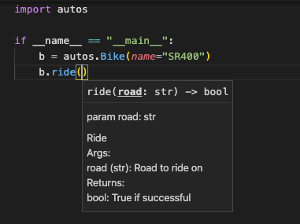
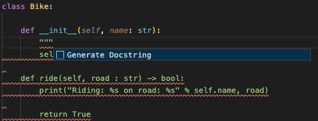
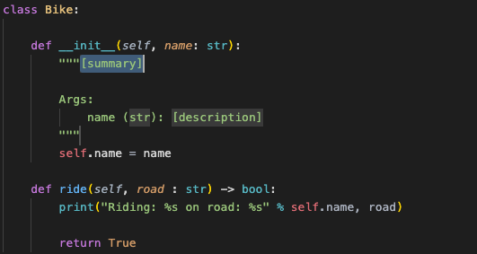
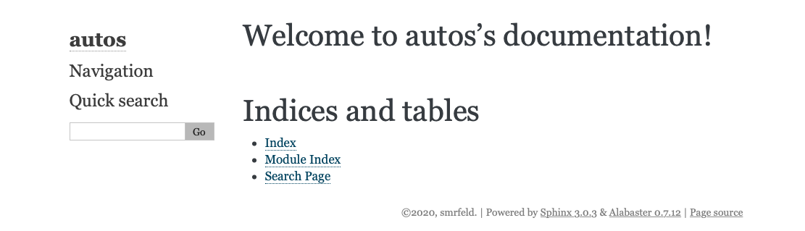
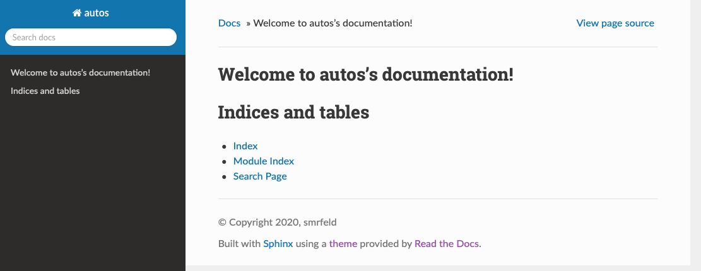
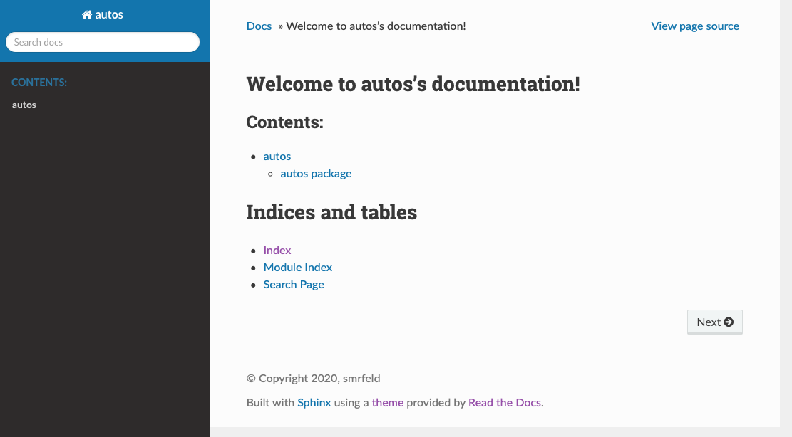
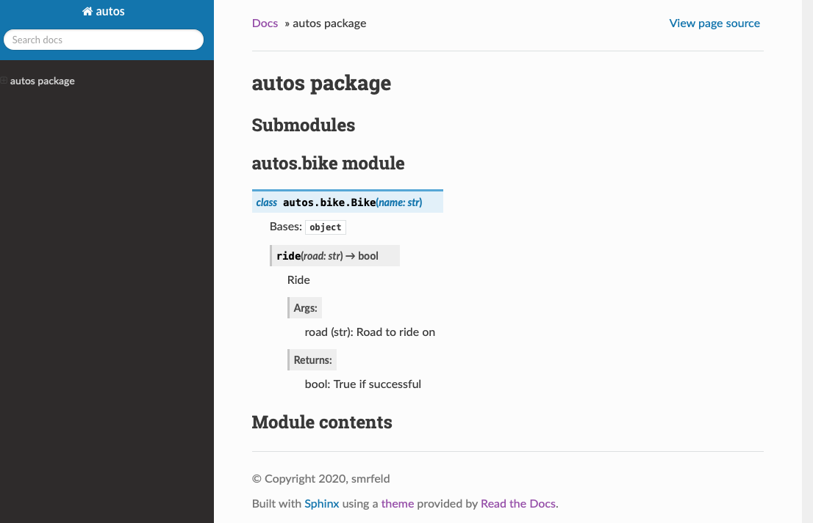
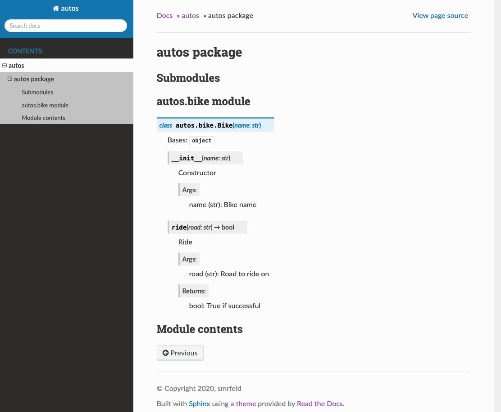

# Documenting your Python library, from zero to website

Documentation is quite a project, but your project is already a project, and who want's another project? Here we will try to describe how to document your project, all in one go.

## Your library

I said we'd do it from scratch, so we will have to make a library. You probably already have a library, so you can easily figure out how to paste your files here.


```
class Bike:

    def __init__(self, name):
        self.name = name

    def ride(self, road):
        print("Riding: %s on road: %s" % (self.name, road))

        return True
```
and the `__init__.py` file:
```
from .bike import *
```
Let's also add a test `tests/test.py` in a separate directory:
```
import autos

if __name__ == "__main__":
    b = autos.Bike(name="SR400")
    b.ride(road="101")
```

Finally, let's make this a real package by including a `setup.py`. You can use a generator, or just steal the default one from [packaging.python.org](https://packaging.python.org/tutorials/packaging-projects/#creating-setup-py) - create `setup.py` with contents:
```
import setuptools

# Load the long_description from README.md
with open("README.md", "r") as fh:
    long_description = fh.read()

setuptools.setup(
    name="Autos",
    version="0.0.1",
    author="smrfeld",
    author_email="smrfeld@smrfeld.com",
    description="A small example package",
    long_description=long_description,
    long_description_content_type="text/markdown",
    url="https://github.com/smrfeld/sphinx_autodoc_tutorial",
    packages=setuptools.find_packages(),
    classifiers=[
        "Programming Language :: Python :: 3",
        "License :: OSI Approved :: MIT License",
        "Operating System :: OS Independent",
    ],
    python_requires='>=3.6',
)
```
Obviously, edit it as you see fit. Here you will also need a `README.md` to serve as the `long_description` (and because) it's good practice.

The final directory structure should look like:
```
autos/__init__.py
autos/bike.py
setup.py
README.md
```

You should now be able to install the library
```
pip install .
```

The test script in the `tests` directory should produce:
```
Riding: SR400 on road: 101
```
The neat thing here is that editing the `test.py` should in any modern IDE (e.g. VS Code) now give you autocomplete suggestions:



Great! On to the documentation.

## Adding documentation

Let's start by adding some documentation. If you are using `VS Code` (which you should be!), you can use the [Python Docstring Generator](https://github.com/NilsJPWerner/autoDocstring) to help you out.

First add `typing` declarations to all the method arguments and return values:
```
class Bike:

    def __init__(self, name: str):
        self.name = name

    def ride(self, road : str) -> bool:
        print("Riding: %s on road: %s" % self.name, road)

        return True
```
Some other common types are:
* `List`, e.g. `List[int]`.
* `Tuple`, e.g. `Tuple[str,float]`.
* `Dict`, e.g. `Dict[str,int]`.

Go under one of the method signatures and type `"""`. It should suggest the documentation string:


Then hit enter to autocomplete the documentation:


Fill in some documentation, for example:
```
class Bike:

    def __init__(self, name: str):
        """Constructor

        Args:
            name (str): Bike name
        """
        self.name = name

    def ride(self, road : str) -> bool:
        """Ride

        Args:
            road (str): Road to ride on

        Returns:
            bool: True if successful
        """
        
        print("Riding: %s on road: %s" % self.name, road)

        return True
```

The neat part is: editing the test, you should already see the doc suggestions.

## Generating the website

You need to install Sphinx:
```
pip install -U sphinx
```
Let's make a new `docs` folder:
```
mkdir docs
cd docs
```
Use `sphinx-quickstart` to get started:
```
sphinx-quickstart
```
Choose all the defaults, i.e. `no` for `> Separate source and build directories (y/n) [n]:`. For project name, I chose `autos`.
You should now have:
```
_build/
_static/
_templates/
conf.py
index.rst
make.bat
Makefile
```
The Makefile is obviously used to build the project. `conf.py` specifies the build, and `index.rst` is the entry point for the website. 

To make the website, run:
```
make html
```
To make different targets, try just `make` to list all possible targets. The resulting pages will be in `_build/html`. The default page looks like this:



I always like the [ReadTheDocs](https://sphinx-rtd-theme.readthedocs.io/en/stable/) theme. Go ahead and install it:
```
pip install sphinx-rtd-theme
```
Let's add it to the configuration in `conf.py`. Add the import statement, and add the rest:
```
import sphinx_rtd_theme

extensions = [
    ...
    "sphinx_rtd_theme",
]

html_theme = "sphinx_rtd_theme"
```
Now we get:



That looks better! But we don't yet have our doc strings we wrote in Python appearing.

## Autogenerate RST files

Converting doc strings into documentation is done using the `sphinx.ext.autodoc` extension as described [here](https://www.sphinx-doc.org/en/master/usage/extensions/autodoc.html). Go ahead and add it to the extensions list in `conf.py`:
```
extensions = [
    "sphinx_rtd_theme",
    "sphinx.ext.autodoc"
]
```

In order for specific classse to appear in the documentation, there must be an RST file referencing them. An example snippet in a `.rst` file might look like this:
```
.. automodule:: autos.bike
   :members:
   :undoc-members:
   :show-inheritance:
```
which shows that the `autos.bike` class should be documented here.

Let's automatically generate them. From inside the `docs` directory, run:
```
sphinx-apidoc -o . ../autos
```
Here `-o .` specifies that the current `docs` directory is the output, and the `../autos` specifies the source directory. We obtain two new files:
```
autos.rst
modules.rst
```
with contents for `autos.rst`:
```
autos package
=============

Submodules
----------

autos.bike module
-----------------

.. automodule:: autos.bike
   :members:
   :undoc-members:
   :show-inheritance:


Module contents
---------------

.. automodule:: autos
   :members:
   :undoc-members:
   :show-inheritance:
```
and for `modules.rst` contains a running list of the modules:
```
autos
=====

.. toctree::
   :maxdepth: 4

   autos
```
Finally, we need to connect these new files to the original `index.rst`. Add a reference to the `modules.rst` in `index.rst`:
```
Welcome to autos's documentation!
=================================

.. toctree::
   :maxdepth: 2
   :caption: Contents:

   modules.rst

Indices and tables
==================

* :ref:`genindex`
* :ref:`modindex`
* :ref:`search`
```

Fire up the `make` command again:
```
make html
```
to obtain the following:



This **almost** worked. We notice that for the class documentation, we are missing the docstrings for the constructor!



For some brilliant reason, the `__init__` method is skipped by default! Let's fix that using [this trick](https://stackoverflow.com/a/5599712/1427316). Add the following snippet to `conf.py` at the bottom:
```
def skip(app, what, name, obj, would_skip, options):
    if name == "__init__":
        return False
    return would_skip

def setup(app):
    app.connect("autodoc-skip-member", skip)
```
Rebuild, making sure clean first:
```
make clean html
make html
```
and you should find the constructor is now documented:



## Hosting your documentation with GitHub

Start by initializing a git repo with `git init .` for the folder which has contents:
```
autos/
docs/
tests/
setup.py
README.md
```
You should also use a `.gitignore` with at least:
```
__pycache__/
.DS_Store
docs/_build/
docs/_static/
docs/_templates
```
Commit the remaining files in the repo, then go on GitHub, create a new repo for this project and push your first commit.
```
git add .
git commit -m "Initial"
git remote add origin https://github.com/...
git push --set-upstream origin master
```

Let's create a new GitHub Actions workflow. They live in a `.github/workflows` directory that does not yet exist. Create it:
```
mkdir .github/
mkdir .github/workflows
touch .github/workflows/docs.yml
open .github/workflows/docs.yml
```
You can choose from a couple differet runners other than `ubuntu-latest` as described [here](https://docs.github.com/en/actions/reference/virtual-environments-for-github-hosted-runners).

You can monitor the progress on your repo page `github.com` under `Actions`.

A common problem is that you used some external library that you installed with `pip install external_library`. Now what - should you add it to the build process for the documentation? **No** - this only adds more dependencies that need to be installed, and it's probably not relevant for the docs. Instead you can edit in `conf.py` the option:
```
autodoc_mock_imports = [
    "external_library"
]
```
such that the build process for the docs will proceed even when the library is missing.

## Final thoughts

Finally, we can complete this guide by adding a badge to your `README.md` that your docs built:


        sudo apt-get update
        sudo apt-get install python3-sphinx